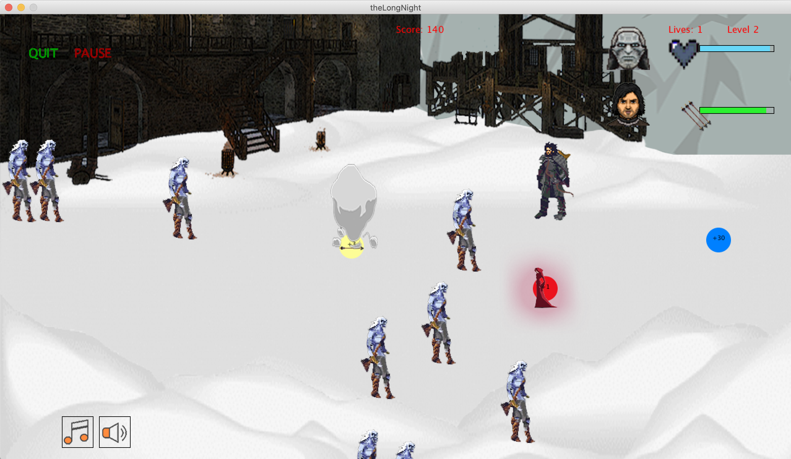
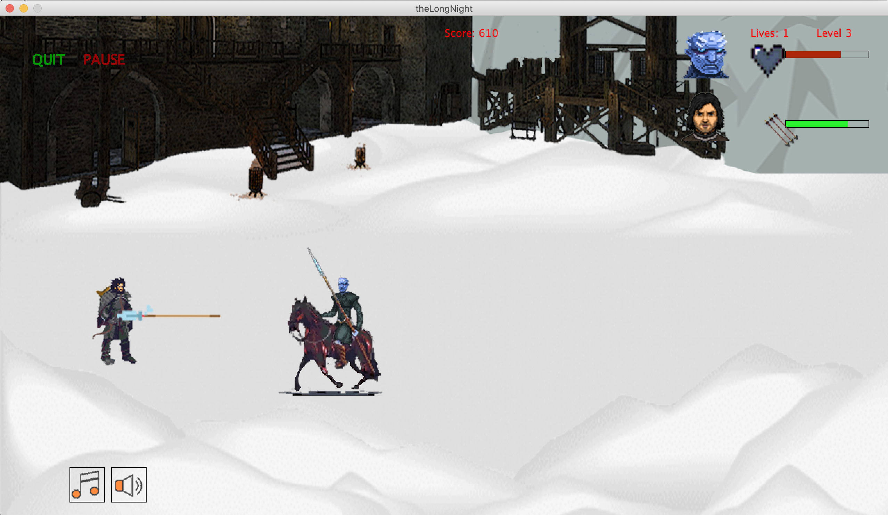
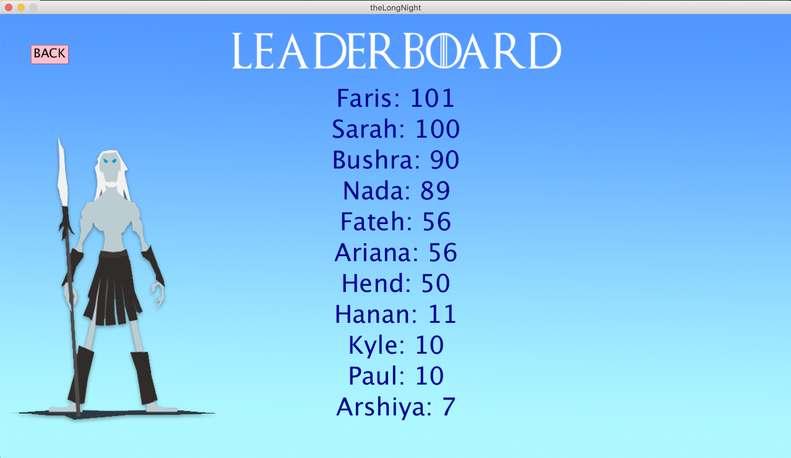

# TheLongNight

The Long Night game is inspired by games such Plants vs. Zombies and the Last Stand, whereby the main character of the game is confronted with an advancing mob of enemies that the character needs to vanquish before they reach him. Our goal is to have the game be Game of Thrones-themed where the main character is Jon Snow (one of the main characters in the series) and the enemy herd is a group of White Walkers (Zombie characters from the series). The main character would be equipped with a set number of projectiles that he could use to target and kill the enemies (e.g. an arrow and a bow, an axe he could throw, etc.). The goal of the game is to kill off the White Walkers before one of them reaches The Wall or one of them collides with Jon Snow.

